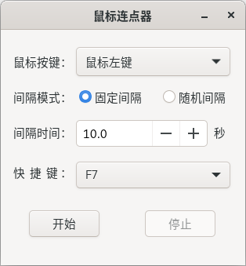
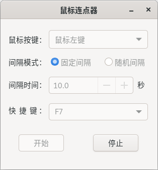

Mouse-Click仓库的Linux移植版

顺便也学习一下log4cpp的使用

## 编译

### 安装依赖

要求系统环境支持GTK3

C++版本为14

安装[log4cpp](http://log4cpp.sourceforge.net/)

### 开始编译

创建编译文件夹 
`make build` 

使用cmake编译 
`cmake --build build --target mouse_click -j4`

## 截图

